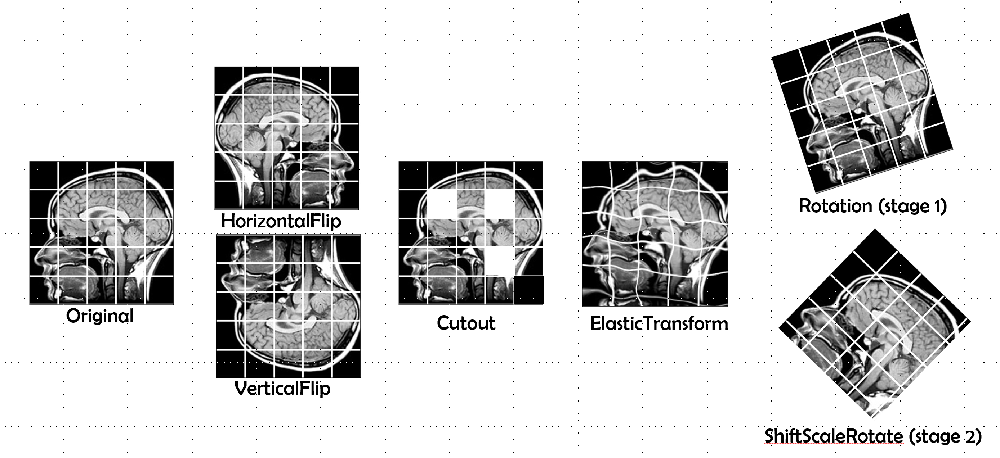
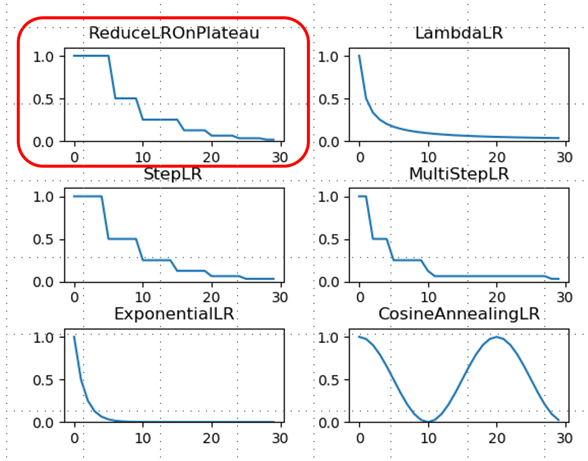
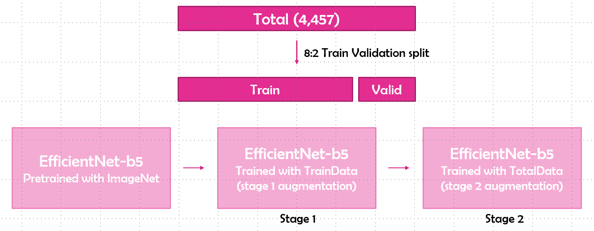
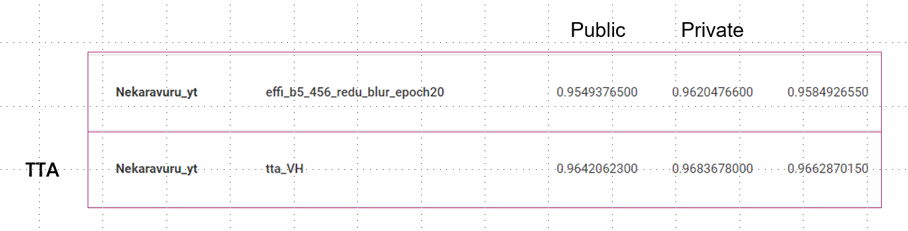

Project 기간: 2021년 2월 18일 → 2021년 2월 24일

[2021 구강계질환 의료영상 인공지능(AI) 경진대회](http://aifactory.space/task/detail.do?taskId=T001727)

# Overview

## 구강계질환 의료영상 인공지능 경진대회

- task1 : 치과 파노라마 사진(X-ray)의 치아 번호를 식별
- task2 : 구강내시경 이미지의 구강암 존재 여부를 분류
- task2에서 최종 1등

# Dataset

구강암은 악성 / 양성 / 음성으로 나누어져 있음

그러나, 악성 / 양성,음성으로 나누어 이진분류하는게 목적

# Method

- 상대적으로 크기가 작은 model(e.g. resnet18, resnet50)을 이용하여 augmentation, optimizer, learning rate scheduler에 관한 실험을 진행
- 최종 model로는 EfficientNet-b5에 선택
- augmentation은 아래와 같이 사용 (Albumentations library)

    Stage 1 : horizontalflip, Verticalflip, cutout, elastictransform, rotation

    Stage 2 : horizontalflip, Verticalflip, cutout, elastictransform, shiftscaleroate

- scheduler는 비교를 통하여 ReduceLROnPlateau를 선택

- 2개의 stage로 나누어 학습
    - stage 1에서는 Train dataset으로 학습을 한 후에 valid dataset으로 모델을 검증

        (stage 1 augmentation)

    - stage 2에서는 학습된 모델을 Total dataset으로 학습을 하여 더 일반화 된 모델을 만듦

        (stage 2 augmentation)

2 stage 학습 방법

- 모델의 일반화 능력을 위하여 Test Time Augmentation (TTA)을 적용
- TTA를 적용한 첫 모델부터 Private Score에서 좋은 성능을 달성

# 평가 기준

## 정량 평가

public data + private data에 대해서 평가

metric은 AUC 사용
